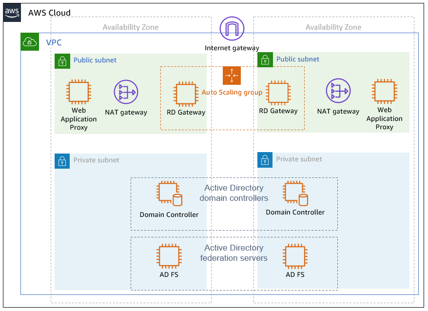

Deploying this Quick Start for a new virtual private cloud (VPC) with
default parameters builds the following Web Application Proxy and AD FS environment in the
AWS Cloud.

// Replace this example diagram with your own. Send us your source PowerPoint file. Be sure to follow our guidelines here : http://(we should include these points on our contributors giude)
[#architecture1]
.Quick Start architecture for _{partner-product-short-name}_ on AWS
[link=images/architecture_diagram.png]

The AWS CloudFormation template creates a fully functional AD FS federation server farm with Web Application Proxy on the AWS Cloud. The template deploys the following components:

* A virtual private cloud (VPC) with resources distributed across two Availability Zones for high availability.*
* Public subnets in each Availability Zone that provide access to and from the internet. The public subnets include network address translation (NAT) gateway instances for outbound internet access, and Remote Desktop Gateway (RD Gateway) instances in an Auto Scaling group for inbound remote administrative access. Web Application Proxy servers are deployed in the public subnets to help provide secure inbound connectivity to web applications.*
* Private subnets in each Availability Zone for running enterprise workloads such as Active Directory domain controllers and AD FS servers, shielded from direct access over the internet.*
* In the private subnets, domain controllers that act as enterprise certificate authorities (CAs) that issue the required SSL certificates to the AD FS infrastructure. For production deployments, you might want to consider commercial certificates issued from a public CA, and we’ll cover this in greater detail later in this guide.
* In the private subnets, two AD FS servers running on Windows Server 2012 R2, which are deployed in each Availability Zone to support high availability and load distribution.
* Security groups to tightly control the flow of traffic between your Amazon EC2 instances.

*The template that deploys the Quick Start into an existing VPC skips
the components marked by asterisks and prompts you for your existing VPC
configuration.
