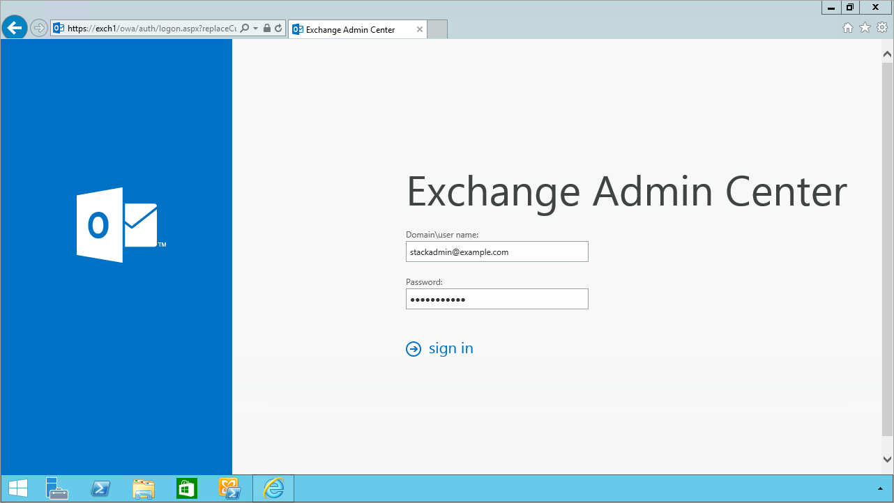
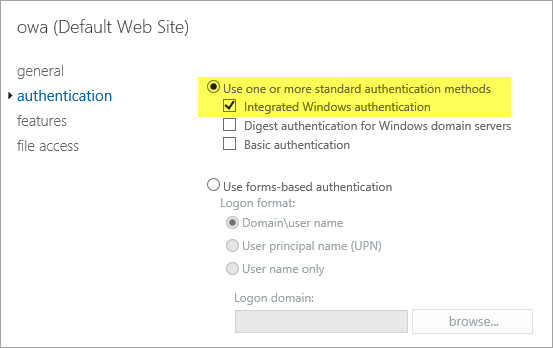
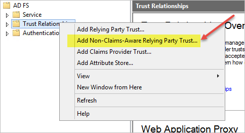
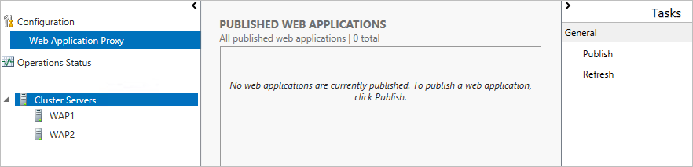
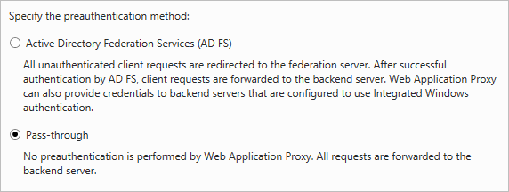
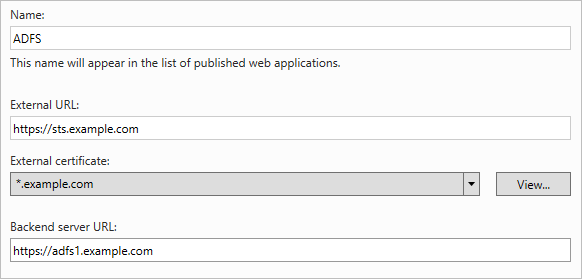
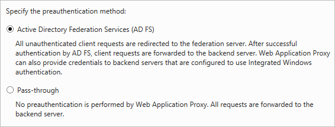
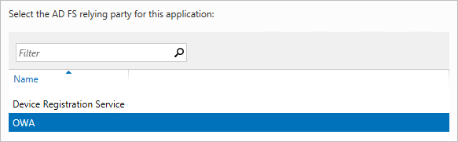
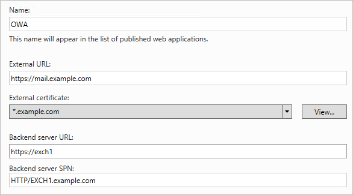
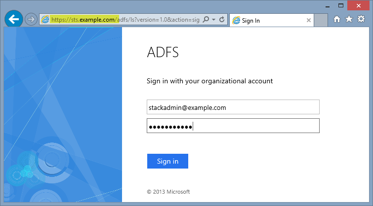

// Add any tips or answers to anticipated questions. This could include the following troubleshooting information. If you don’t have any other Q&A to add, change “FAQ” to “Troubleshooting.”

== FAQ

*Q.* I encountered a *CREATE_FAILED* error when I launched the Quick Start.

*A.* If AWS CloudFormation fails to create the stack, we recommend that you relaunch the template with *Rollback on failure* set to *Disabled*. (This setting is under *Advanced* in the AWS CloudFormation console, *Options* page.) With this setting, the stack’s state is retained and the instance is left running, so you can troubleshoot the issue. (For Windows, look at the log files in %ProgramFiles%\Amazon\EC2ConfigService and C:\cfn\log.)
// If you’re deploying on Linux instances, provide the location for log files on Linux, or omit this sentence.

WARNING: When you set *Rollback on failure* to *Disabled*, you continue to incur AWS charges for this stack. Please make sure to delete the stack when you finish troubleshooting.

For additional information, see https://docs.aws.amazon.com/AWSCloudFormation/latest/UserGuide/troubleshooting.html[Troubleshooting AWS CloudFormation^] on the AWS website.

*Q.* I encountered a size limitation error when I deployed the AWS CloudFormation templates.

*A.* We recommend that you launch the Quick Start templates from the links in this guide or from another S3 bucket. If you deploy the templates from a local copy on your computer or from a location other than an S3 bucket, you might encounter template size limitations. For more information about AWS CloudFormation quotas, see the http://docs.aws.amazon.com/AWSCloudFormation/latest/UserGuide/cloudformation-limits.html[AWS documentation^].

== Appendix: Publishing Outlook Web App to the Internet with AD FS Pre-Authentication

Instead of using the nested AWS CloudFormation template to launch a new environment, you can use the https://fwd.aws/YAkEy[Web Application Proxy and AD FS template] included with this Quick Start to launch the components into an existing VPC.

*Important* The sub-template for Web Application Proxy and AD FS provided with this guide is built to work with existing VPCs that have two public and two private subnets, and an existing Active Directory Domain Services implementation. More specifically, it is designed to work with the existing Microsoft-based AWS Quick Starts, such as Exchange Server, SharePoint Server, and Lync Server.

In this appendix, we’ll show you how to launch the Web Application Proxy and AD FS infrastructure on top of the Exchange Server Quick Start. Then we’ll walk through the steps to publish Outlook Web App (OWA) to the internet using Web Application Proxy and AD FS.

*Note* This walkthrough details the process of publishing OWA using Integrated Windows authentication. You can follow the same general process for Exchange Server 2010, or other web applications you want to publish with Integrated Windows authentication. It is also possible to publish OWA with claims-based authentication using Exchange Server 2013 SP1 or newer, but that scenario is beyond the scope of this guide.

1.  Launch the https://fwd.aws/NvamP[Exchange Server Quick Start].

2.  Once the Exchange Server 2019 stack has been created successfully, launch the https://fwd.aws/5VrKP[Web Application Proxy and AD FS template]. As shown previously in this guide, you’ll need to specify the _KeyPairName_ for your chosen region. Additionally, you’ll need to specify the IDs for your existing VPC and for the public and private subnets.

3.  Initiate a Remote Desktop Protocol (RDP) connection to one of the RD Gateway instances. You can retrieve the Elastic IP for the RD Gateway servers in the Amazon EC2 console. From there, use RDP to connect to the EXCH1 server.

4.  On EXCH1, navigate to the Exchange Admin Center (https://exch1/ecp) in a web browser. Sign in by using the stackadmin user account and password you specified when building the stack.

[#Additional1]
.Logging into the Exchange Admin Center
[link=images/image6.png]

[start=5]
5.  In the left pane, choose *Servers*, *Virtual directories*.

[#Additional2]
.Viewing the virtual directories on EXCH1
[link=images/image7.png]
image::../images/image7.png[Additional2,image,width=546,height=308]

[start=6]
6.  Double-click *owa (Default Web Site)* on the EXCH1 server. Choose *Authentication*, *Integrated Windows authentication*, and then choose *Save*. You should also change the corresponding setting on the ECP virtual directory on EXCH1.

[#Additional3]
.Setting OWA authentication to Integrated Windows
[link=images/image8.png]

*Note* In a load-balanced production environment, you would modify this setting on each Exchange server that is running the Client Access role.

[start=7]
7.  Establish an RDP connection to the ADFS1 server. In *Control Panel*, choose *Administrative Tools*, and then launch the *ADFS Management* snap-in.

8.  Open the context (right-click) menu for *Trust Relationships*, and then choose *Add Non-Claims-Aware Relying Party Trust* to start the wizard.

[#Additional4]
.Adding a non-claims-aware relying party trust
[link=images/image9.png]

[start=9]
9.  On the welcome page of the wizard, choose *Start*, and type a display name such as *OWA*. Provide a unique identifier string for the non-claims-aware relying party trust. Use the default service name created by the Quick Start (e.g., http://sts.example.com/adfs/services/trust) for the URL.

10.  Indicate that you do not want to configure multi-factor authentication, and then choose *Next*.

11.  Go through the remaining screens without making changes. On the final screen, leave the *Open the Edit Issuance Authorization Rules* option selected, and then choose *Close*.

12.  On the *Edit Claim Rules* screen, choose *Add Rule*, *Permit Access to All Users*, and then choose *Finish*.

13.  Establish an RDP connection to the WAP1 server. In *Control Panel*, choose *Administrative Tools*, and then launch the *Remote Access Management* snap-in.

[#Additional5]
.Viewing the Remote Access Management console
[link=images/image10.png]

To publish OWA to the internet, you’ll need to create two rules. The first rule will be a pass-through authentication rule to the AD FS server. This will allow users to pre-authenticate before being connected to OWA.

[start=14]
14.  Under *Tasks*, choose *Publish*.

15.  On the Welcome screen, choose *Next*. On the *Preauthentication* tab, choose *Pass-through*.

[#Additional6]
.Selecting the pass-through pre-authentication method
[link=images/image11.png]

[start=16]
16.  Provide a name such as ADFS for the rule. Specify the external URL, the external certificate, and the back-end server URL as shown in Figure 11.

[#Additional7]
.Configuring the publishing rule
[link=images/image12.png]

*Note* If you’ve implemented internal load balancing for the AD FS tier, you can set the back-end server URL to a load-balanced endpoint instead of an individual server name.

[start=17]
17.  Choose *Publish,* and then *Close* to exit the wizard.

18.  Choose *Publish* again to create a new rule for OWA. This time, set the pre-authentication method to *Active Directory Federation Services (AD FS)*, and then choose *Next*.

[#Additional8]
.Selecting the AD FS pre-authentication method
[link=images/image13.png]

[start=19]
19.  For the relying party for the application, select the relying party trust you created on the AD FS server, and then choose *Next*.

[#Additional9]
.Selecting the relying party
[link=images/image14.png]

[start=20]
20.  Provide a name such as OWA for the rule. Specify the external URL, external certificate, back-end URL, and service principal name (SPN) for the back-end server, as shown in Figure 14.

[#Additional10]
.Configuring rule details
[link=images/image15.png]

*Note* If you’ve implemented internal load balancing for the Exchange client access tier, you can set the back-end server URL and SPN to a load-balanced endpoint instead of an individual server name.

[start=21]
21.  Choose *Publish* and close the wizard.

22.  Establish an RDP connection to DC1. In *Control Panel*, choose *Administrative Tools*, and then launch the *Active Directory Users and Computers* snap-in.

23.  Navigate to the *Computers* container, right-click the WAP1 computer, and then choose *Properties*. On the *Delegation* tab, choose *Trust this computer for delegation to specified services only*. Check the option to use any authentication protocol, and add the HTTP service type on the EXCH1 computer to the list, as shown in Figure 15. Choose *Apply*, and then choose *OK*.

[#Additional11]
.Configuring Kerberos constrained delegation
[link=images/image16.png]
image::../images/image16.png[Additional11,image,width=315,height=353]

Now you are ready to test accessing OWA from an external workstation or server over the internet.

[start=24]
24.  If you did not use your own domain name, you’ll need to edit the hosts file on your machine to allow your computer to resolve the endpoints at example.com: Add a mapping for *sts.example.com* and *mail.example.com* to your local hosts file, making sure that both hosts resolve to the public EIP of the WAP1 server.

25.  Open a web browser from your external workstation or server. Navigate to *mail.example.com*. You should be redirected to the federation service and prompted for authentication. Provide the stackadmin user name and password, and then choose *Sign in*.

[#Additional12]
.Pre-authenticating to AD FS
[link=images/image17.png]

If the authentication is successful, the connection should be proxied to the EXCH1 server through the Web Application Proxy, as shown in Figure 17.

[#Additional13]
.Connected to the published application
[link=images/image18.png]
image::../images/image18.png[Additional13,image,width=315,height=353]